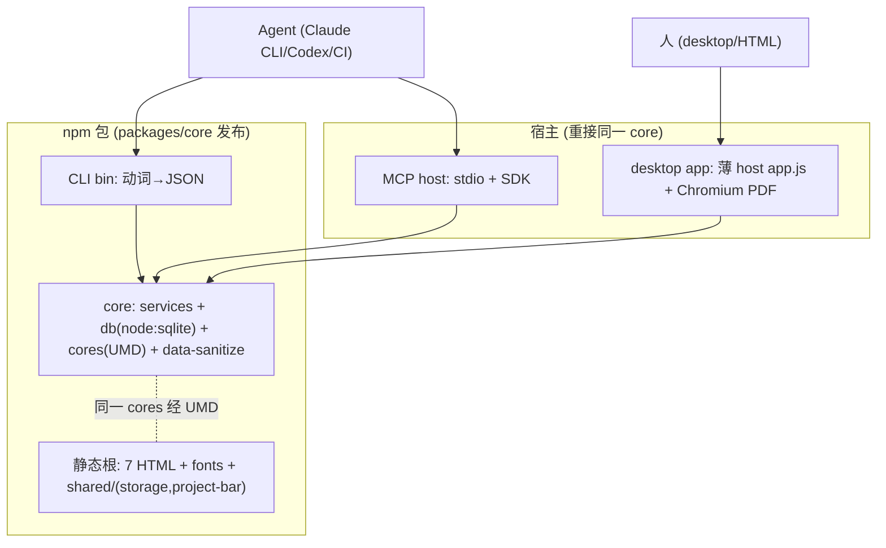
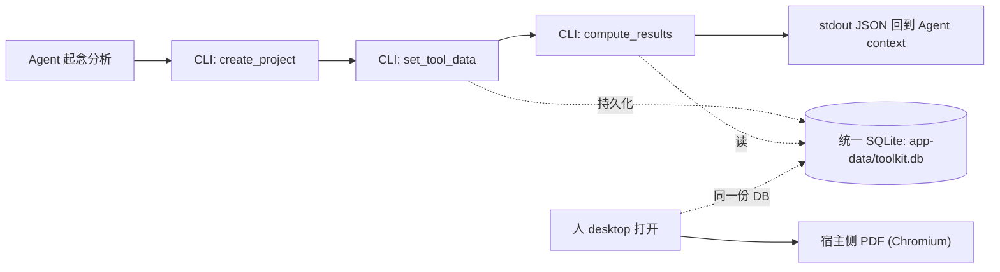

# AI Native CLI 分发层 - Plan

## Goal Capsule

- **Objective:** 把 consulting-toolkit 改造为可独立发布的 AI Native 产品 —— 抽出一个纯计算 + 存储的 core 包，让 CLI（面向 Agent 的第一入口）经 npm `npx` 即跑，desktop app 与 MCP 作为同一 core 的其他宿主。
- **Product authority:** 本 plan 只 own 分发层（core 下沉 + CLI 入口 + 数据统一）。UI 视觉改版（DESIGN.md 落地）、consulting-team 路由层、报告回流展示面均不在活动范围内。
- **Open blockers:** 无 Resolve Before Planning 级阻塞。

---

## Product Contract

### Summary

抽出一个纯计算 + 持久化的 core 包（六个工具的计算核 + SQLite，无 HTTP、无 Chromium），CLI 作为面向 Agent 的第一入口走 npm 包 `npx` 即跑。desktop app 与 MCP 重接到同一 core。PDF 导出留在宿主侧；Agent 经 CLI 拿到的是结构化 JSON，PDF 由人手动导出。

### Problem Frame

consulting-toolkit 现在是一个本地工具箱：双击 HTML 离线用，或 `npm start` 起本地服务。它有一个已经建好的 MCP server，但建好之后基本没被用过 —— 用户自己一直开 HTML 点。真正的调用方不是用户本人，是 `consulting-team` 这个咨询报告 skill：它在生成报告时应该能主动调 Kano、Pugh 这类定量分析，把数据填进去、算出结论、取回作为报告内容。

要让这个工具箱朝"独立发布的产品"迭代，瓶颈不在"能不能调"（MCP 已经能调），而在分发。现在仓库根没有 `package.json`，`.mcp.json` 里写死了用户机器上的绝对路径（`cwd` 指向 `/Users/zcdeng/projects/consulting-tools`、数据目录指向 `/Users/zcdeng/Library/Application Support/...`），任何人 clone 下来都必须手改配置才能跑。desktop app、MCP、未来的 CLI 三处各自直接读 `server/` 源码和 `shared/cores`，没有一层被明确定义的、可版本化发布的 core。这个结构没法"发布"，只能"拷源码"。

<!-- ce-section: work-relationships -->
### How This Work Fits Together

本 plan own 分发层。周边工作是当前理解，不是承诺的路线图；后续 plan 可修订、拆分、合并或丢弃它们。

- **consulting-team 路由层** —— 让 Agent 知道六个工具存在、何时触发、结果写哪。
  - **Depends on:** 本 plan（CLI/core 是路由层要调的目标）。
  - **Enables:** "主动调用"闭环真正跑通。
- **报告回流展示面** —— documents 表已有完整 CRUD 但前端零引用，Agent 写入的分析/依据说明需在 UI 可见。
  - **Can proceed independently of:** 本 plan，但依赖 documents 数据模型。
- **UI 视觉改版** —— DESIGN.md（Steep）落地到七个页面 + 抽共享 CSS token。
  - **Can proceed independently of:** 本 plan；与 AI Native 无依赖，纯产品感提升。
  - **Still to decide:** dark mode、CJK 字体、密集矩阵密度三处与 Steep 的硬冲突。

### Key Decisions

- **core 下沉为多宿主共享包** —— 抽出独立 core 包作为被共享的产品资产，CLI / MCP / desktop 都重接到它，而非在现有 `server/` 上加一个 CLI 门面。选定它因为 desktop app、CLI、MCP 是同一产品的多个宿主，core 的边界需要先定死。Governs R1, R2, R3, R4, R7
- **core 只装纯计算 + 存储** —— core 含六个计算核 + services + SQLite，不含 HTTP server、不含 Chromium。保住 core 干净、CLI 装得快。Governs R2, R8
- **PDF 导出留在宿主侧** —— PDF 要整个内嵌 HTTP server + Chromium（`server/pdf/render.js` 里 `require("../app")` 起服务再用 Playwright 截图），是重宿主能力，不进 core。Governs R8, R9
- **CLI 面向 Agent，输出结构化 JSON** —— "取回展示"由 Agent 拿 `compute_results` 的 JSON 自行渲染进咨询报告；PDF 由人手动导出，不是 CLI 的交付物。Governs R5, R9
- **统一数据目录并迁移旧数据** —— desktop 现读 app-data、`npm start` 现读 `server/data`，是两份 DB；统一后 Agent 用 CLI 写的项目 desktop 才看得到。Governs R6
- **npm 包 `npx` 即跑** —— 产品经 npm 分发，去掉 `.mcp.json` 里的硬编码绝对路径。Governs R3, R4
- **desktop app 重接到 core 包** —— 不允许 core 包与 desktop 内嵌旧代码并存两套实现。Governs R7

### Requirements

**Core 包**

- R1. 抽出一个独立 core 包，承载六个工具的计算核（`shared/cores/*`）、服务层（projects / tooldata / documents / compute）与 SQLite 持久化。core 不含 HTTP server、不含 Chromium、不含 PDF 渲染。
- R2. core 包零重型依赖：持久化用 Node 内置 `node:sqlite`，不引入 Playwright 或其它大型依赖，使 `npx` 冷启动保持轻量。
- R3. core 包的所有路径解析（数据目录、DB 路径、导出目录）经环境变量或参数注入，不含任何写死的机器绝对路径。

**CLI 入口**

- R4. 提供一个 npm 可发布的 CLI，注册 `bin` 入口，`npx <pkg> <verb>` 可运行，输出面向 Agent：机器可读的结构化 JSON 到 stdout，错误经 exit code + stderr 表达。
- R5. CLI 至少覆盖 Agent 调用链所需的动词：创建项目、写入工具数据、计算结果、读取结果（对应现有 `create_project` / `set_tool_data` / `compute_results` / `get_tool_data` 能力）。CLI 不提供 PDF 导出动词。

**数据与兼容**

- R6. 统一数据目录：desktop app 与 CLI/MCP 默认读同一份 DB，并提供旧数据（`server/data/toolkit.db` 及旧 app-data 位置）的迁移，使历史项目不丢、Agent 写入的项目在 desktop 可见。
- R7. desktop app 重接到 core 包：Rust 侧不再 spawn 内嵌的旧 `server/` 目录，改为依赖发布的 core，消除"core 包 + desktop 内嵌旧代码"两套实现并存。

**宿主重接**

- R8. PDF 导出能力保留在宿主侧（desktop / server 宿主），继续以内嵌 HTTP server + Chromium 方式工作，core 包不承担 PDF。
- R9. 现有浏览器侧的七个 HTML 页（六个工具页 + index.html）继续可用：它们现从仓库根相对路径引 `shared/cores/*` 与 `fonts/*`，core 下沉后这套引用需保持工作（core 对浏览器侧仍可读）。

### Actors

- A1. **Agent（第一用户）** —— 能跑 shell 的 Agent（Claude CLI、Codex、CI），经 CLI 调用分析能力并取回 JSON。CLI 的输出格式、交互模式、文档都以它为对象设计。
- A2. **consulting-team skill** —— 生成咨询报告时经 CLI/MCP 调定量分析，把结论作为报告内容。（路由层不在本 plan，但它是 CLI 的主要预期调用场景。）
- A3. **人类用户** —— 用 desktop app 或离线 HTML 操作；手动导出 PDF。是 CLI 的顺带使用者，不是主用户。

### Key Flows

- F1. Agent 调用分析
  - **Trigger:** Agent（A1/A2）需要对一份材料做 Kano / Pugh / FMEA 等定量分析。
  - **Steps:** Agent 经 CLI 创建或定位项目 → 写入工具数据 → 调计算动词 → 读回结构化 JSON → 自行渲染进咨询报告。
  - **Outcome:** 分析结论以 JSON 形式回到 Agent 上下文；项目与数据持久化在统一 DB。
  - **Covered by:** R4, R5, R6
- F2. 人取回成品
  - **Trigger:** 用户（A3）需要一份可交付的 PDF。
  - **Steps:** 用户在 desktop app（或 server 宿主）里打开对应项目 → 触发 PDF 导出 → 宿主侧经内嵌 HTTP server + Chromium 渲染出 PDF。
  - **Outcome:** PDF 落盘；core 不参与。
  - **Covered by:** R8
- F3. 跨宿主数据连续
  - **Trigger:** Agent 用 CLI 写了项目数据后，用户想在 desktop 里看。
  - **Steps:** 统一数据目录使 CLI 与 desktop 读同一份 DB → desktop 打开即见 Agent 创建的项目。
  - **Outcome:** 无"CLI 写的 desktop 看不到"的断裂。
  - **Covered by:** R6, R7

### Acceptance Examples

- AE1. CLI 计算结果
  - **Covers R4, R5.**
  - **Given:** 一个合法的工具数据 payload（如 Pugh 矩阵）。
  - **When:** Agent 跑 `npx <pkg> compute --tool pugh --data <json>`。
  - **Then:** stdout 输出与现有 `compute_results` 一致结构的 JSON，exit code 0。
- AE2. CLI 在无 Chromium 环境下可用
  - **Covers R2, R8.**
  - **Given:** 一台没装 Playwright/Chromium 的机器。
  - **When:** Agent 跑任一计算 / 数据动词。
  - **Then:** 命令成功，不因缺 Chromium 失败；core 不要求该依赖。
- AE3. Agent 写的项目 desktop 可见
  - **Covers R6, R7.**
  - **Given:** Agent 用 CLI 创建了一个项目并写入数据。
  - **When:** 用户打开 desktop app。
  - **Then:** 该项目出现在 desktop 项目列表中，数据一致。
- AE4. 缺参数时 CLI 对 Agent 友好报错
  - **Covers R4.**
  - **Given:** Agent 调用 CLI 时缺少必填参数或传了非法 tool 名。
  - **When:** 命令执行。
  - **Then:** 非零 exit code，stderr 给出可读的结构化错误，不抛出未捕获异常堆栈。

### Success Criteria

- 在干净机器上 `npx <pkg> --help` 可运行，无需手改任何配置或绝对路径。
- 同一台机器上 desktop app、CLI、MCP 读写同一份项目数据。
- core 包安装不拉取 Chromium / Playwright。
- 现有七个 HTML 页（六个工具页 + index.html）在重接后仍可打开并完成一次端到端分析。

### Scope Boundaries

**Deferred for later**

- UI 视觉改版（DESIGN.md / Steep 落地）—  brainstorm 中途被明确叫停。
- consulting-team 路由层（augment-map 路由表 + 分层触发规则 + 依据说明落 documents）— 已在对话中定过触发与依据策略，但不属本 plan。
- 报告回流展示面（documents 前端展示）— 依赖展示层单独规划。
- core 包的进一步纯化（如把 services 与 HTTP 完全解耦为独立包）— 本 plan 只做到"core 可被 CLI/MCP/desktop 共享"。

**Outside this product's identity**

- 把 PDF 导出塞进 core / CLI —— 与"core 纯计算"的定位直接冲突，明确拒绝。
- 交互式人类向 CLI（向导、彩色表格）— CLI 面向 Agent，人类交互由 desktop / HTML 承担。

### Dependencies / Assumptions

- 依赖 Node ≥ 25 以使用内置 `node:sqlite`（`package.json` engines 已声明 `>=25.0.0`）。
- 假设 desktop app 的 Rust 侧可以改为加载发布的 core（而非 spawn 内嵌 `server/` 目录）；`desktop/consulting_desktop.rs` 现 spawn `server/app.js` 并注入 `TOOLKIT_ROOT_DIR` / `TOOLKIT_DATA_DIR`。
- 假设六个 HTML 从根相对路径引 `shared/cores` / `fonts` 的方式，在 core 下沉后仍能被 HTTP server / file:// 服务到。

### Outstanding Questions

- 包名与 npm scope（`consulting-toolkit` 为工作名；发布公共 registry 还是先用 workspace 本地 link 验证）— **Deferred to Planning**。首版 desktop 构建用本地 `npm pack` tarball 安装 core，解开"未发布先构建"的 chicken-and-egg。
- desktop 重接后 Rust 侧定位 core 资源的确切 staging 树（已在 U5 给出候选结构，实现时定稿）— **Deferred to Planning**。

### Assumptions（补充）

- 发布采用单包 `consulting-toolkit`（core + 静态根 + CLI），PDF host 不进包、随 desktop（per KTD9）。
- CLI 面向的 Agent 机器多为 Node 20/22 LTS，故 KTD11 的版本闸门是首次接触的必需防线；不考虑以 better-sqlite3 替换 `node:sqlite`（保持零依赖）。

### Sources / Research

- `server/mcp/tools.js` — 现有 7 个 MCP tool（list_projects / create_project / get_tool_data / set_tool_data / compute_results / add_document / export_pdf），其中 6 个非 export 动词是 CLI 动词面的直接参照。
- `server/services/compute.js`、`server/services/tooldata.js`、`server/db/index.js`、`server/db/schema.sql` — core 包的 services + 持久化来源。
- `shared/cores/*.js` — 六个计算核，浏览器与 Node 双端共享（`module.exports` + `root.ToolkitCores`）。
- `server/pdf/render.js` — PDF 依赖内嵌 HTTP server（`require("../app")`）+ Playwright，故留宿主侧。
- `desktop/consulting_desktop.rs` — Rust spawn `server/app.js`，注入 `TOOLKIT_ROOT_DIR` / `TOOLKIT_DATA_DIR`，是 desktop 重接的改造点。
- `.mcp.json` — 含写死的 `cwd` 与 `TOOLKIT_DATA_DIR` 绝对路径，是去硬编码的对象。

---

## Planning Contract

**Product Contract preservation:** unchanged — no R/A/F/AE renumbering, no scope change. Planning added only the sections below the Product Contract.

### Key Technical Decisions

- KTD1. **core 落在 `packages/core` 子目录** (session-settled: user-directed — chosen over 只拆 config 不迁目录： 边界物理清晰、发布 `files` 可控，避免 core 与宿主源码混在一起). Governs R1, R3.
- KTD2. **拆分 `server/config.js` 为 core 配置 + host 配置** —— core 拿 `dataDir`/`dbPath`/`exportsDir`/`isValidTool`/tools-map 的 core 侧；host 留 `port`/`host`/`token`/`allowedHostHeader`/tools→HTML 映射。消除 host/core 混合模块这个最大泄漏。Governs R1, R3.
- KTD3. **统一数据目录为 desktop app-data 一份，CLI 迁就之** (session-settled: user-directed — chosen over 另立中立目录三者都迁： 与 `.mcp.json` 现状一致，desktop 现有数据原位不动；代价是 CLI 在未装 desktop 的机器上也建该目录树，可接受). Governs R6.
- KTD4. **CLI 动词 = MCP 六动词 + `update_project` + `schema` 内省** (session-settled: user-directed — chosen over 严格镜像 MCP 不加 update_project： services 已有 `updateProject`，补上让 Agent 完成重命名/归档闭环；`schema`  verb 让非 MCP Agent 也能运行时拿到 data_json 形状). Governs R5.
- KTD5. **CLI 输出契约：stdout 纯 JSON、结构化错误、非零 exit code** —— 复用 services 抛出的 `statusCode` 标记错误（400 invalid tool/status、404 project not found）映射为稳定 code；成功只写 JSON 到 stdout，日志走 stderr。Agent 可管道、可重试。Governs R4, R5.
- KTD6. **core 零运行时依赖，CLI 校验不用 zod** —— services+db+cores+sanitize 不引外部包（持久化用 `node:sqlite`，Node ≥25 内置）；`@modelcontextprotocol/sdk` 与 `playwright` 留在宿主侧，core `dependencies` 为空。CLI 输入校验（tool enum、project status enum）手写、基于 cores keys 与 core 导出的常量，不引入 zod（zod 现仅是 MCP SDK 的传递依赖，未声明）。Governs R2.
- KTD7. **desktop 仍 spawn 一个薄 host `app.js`，但该 host 不进发布的 core 包** —— webview 仍需 HTTP + token 握手，Rust 入口形态不变；host `app.js`（HTTP + token + 静态服务 + PDF 接线 + Playwright）随 desktop 打包、安装自己的 Playwright，不在 npm 发布包内。`build-mac-app.mjs` 的 `installServerDependencies` 装发布的 core + host 自带的 Playwright。Governs R7, R8.
- KTD8. **浏览器侧 `shared/` 布局在发布包的静态根下保留** —— 七个 HTML 硬编码 `shared/cores/*`、`shared/data-sanitize.js`、`fonts/*` 相对路径（UMD 无打包器），所以发布包必须让 `shared/` 与 `fonts/` 作为 HTML 的同级存在，Node 与浏览器各自经 UMD 分支消费同一批 cores。静态根目录下只放浏览器资产，不放 core 源码/db/bin。Governs R9.
- KTD9. **单包发布 `consulting-toolkit`（core + 静态根 + CLI），PDF host 出包** (session-settled: user-directed — chosen over 两个包 core+host 或三个包 core/cli/host： 一个可 npx 的零依赖包交付 Agent 价值，PDF 随 desktop 这个唯一能出 PDF 的宿主，避免 host 依赖 Playwright 污染零依赖 core). Governs R4, R7, R8.
- KTD10. **两份 DB 都有数据时自动合并** (session-settled: user-directed — chosen over 拒绝提示手动 或 app-data 为准老的警告不迁： 实测两份都常有数据，U3 原"目标无库才迁"在此状态静默丢 npm-start 时期 project；id 为随机前缀碰撞极不可能，ATTACH + INSERT OR IGNORE 三张表保住全部历史). Governs R6.
- KTD11. **CLI 前置 Node ≥25 版本闸门 + DB_BUSY 可重试错误码** —— CLI 启动先查 Node 版本，不足则结构化报错（`NODE_VERSION_UNSUPPORTED`）非零退出；`SQLITE_BUSY`/`SQLITE_LOCKED` 映射为稳定可重试 code（`{error:{code:"DB_BUSY",retryable:true}}`），不抛裸堆栈（AE4）。统一 DB 后 desktop 长驻进程与 CLI 并发写是常态，须可区分"可重试争用"与"永久失败"。Governs R4, R6.

### Assumptions

- 目标 npm 包名在发布时可用（public registry 或先用 workspace 本地 link 验证）；若被占，改名是发布动作，不改架构。
- desktop 重接后 Rust 仍能用同一套 `TOOLKIT_*` 环境变量契约驱动新 host `app.js`；契约字段不变，仅指向的资源位置变。新 host `app.js` 必须继续实现 `GET /token`（返回注入 token，供 Rust `wait_for_server` 握手，`consulting_desktop.rs:153-183`）与 loopback `Host` 校验。
- 数据迁移是一次性文件搬迁（WAL 下 `toolkit.db`+`-shm`+`-wal` 一起移，或先 checkpoint），schema 三张表无数据变换。
- CLI 在未装 desktop 的机器上首次运行会创建 app-data 目录树，属预期行为，不视为副作用。

### High-Level Technical Design

core / 宿主 / 发布的关系：

数据流（一次 Agent 调用）：

### Sources / Research

- `server/services/{projects,tooldata,documents,compute}.js`、`server/db/{index.js,schema.sql}` — core 的 services + 持久化来源；`compute.js` 唯一聚合六 cores。
- `server/config.js:4-10,31-35` — 全部 env 读取的单一收口（`TOOLKIT_ROOT_DIR/DATA_DIR/DB_PATH/EXPORTS_DIR/PORT/HOST/TOKEN`），拆分点。
- `shared/cores/*.js`、`shared/data-sanitize.js` — UMD 双端（`module.exports` + `root.ToolkitCores`），Node 移动安全、浏览器需保 `shared/` 布局。
- `server/pdf/render.js:9-29,61-62` — 自起 HTTP server + `config.tools[tool]` + Chromium，确认留宿主；PDF 契约是"需要 HTML 根的静态 server"，非特定 `app.js`。
- `server/mcp/tools.js:9-13,43-95` — CLI 动词参照 + `text()` JSON envelope + 重复的 tool enum（应单一来源）。
- `desktop/consulting_desktop.rs:30-69,153-183`、`desktop/build-mac-app.mjs:172-298` — Rust 注入契约与打包 staging，desktop 重接的改造点。
- `.mcp.json:8-11`、`AGENTS.md:11` — app-data 共享是既定意图；`cwd`/`TOOLKIT_DATA_DIR` 绝对路径待去硬编码。

---

## Implementation Units

### U1. 抽 core 包骨架与 config 拆分
- **Goal:** 建立 `packages/core`，把 services/db/cores/data-sanitize 物理迁入，并拆分 config 为 core/host 两半。
- **Requirements:** R1, R2, R3
- **Dependencies:** 无
- **Files:** 新建 `packages/core/package.json`、`packages/core/index.js`、`packages/core/config.js`（core 半）、`packages/core/db/`、`packages/core/services/`、`packages/core/cores/`、`packages/core/data-sanitize.js`；修改 `server/config.js`（保留 host 半）、`server/services/*`、`server/db/*`（改为引用 core 或移除）
- **Approach:**
  1. core `package.json`：`name`、`version`、`type: commonjs`、`engines: node>=25`、`dependencies: {}`、`files` 含 `db/schema.sql`。
  2. config 拆分：core 侧暴露 `dataDir`/`dbPath`/`exportsDir`/`isValidTool`（dataDir 经注入，默认 app-data 一份，见 KTD3）；host 侧留 `port`/`host`/`token`/`allowedHostHeader`/tools→HTML 映射。
  3. services/db 改为从 core 内部相对引用 cores 与 sanitize；对外 `packages/core/index.js` 导出 `services` + `compute` + `schema`。
- **Patterns to follow:** 现有 `server/services/compute.js` 的 cores 聚合；`server/config.js` 的 env 收口。
- **Test scenarios:**
  - core 在无 `server/` 依赖下可被 `require`，`compute('qfd', sample)` 返回与现 `cores.test.js` 相同结构。
  - `packages/core/db/schema.sql` 随 `files` 打包存在，`openDatabase(tmpPath)` 建库成功。
  - config 拆分后 host 仍能解析 `port`/`host`/`token`，core 不再引用 `allowedHostHeader`。
- **Verification:** `node --test packages/core/test/*.test.js` 通过；core `require` 不触发 `server/app.js` 或 `playwright` 加载。

### U2. CLI bin：Agent-first 动词 + JSON 契约
- **Goal:** 在 core 之上实现 `bin` 入口，暴露六个动词 + `update_project` + `schema`，stdout 纯 JSON、结构化错误、非零 exit code。
- **Requirements:** R4, R5
- **Dependencies:** U1
- **Files:** 新建 `packages/core/bin/<pkg>.js`（文件名随最终包名定，见 Outstanding Questions）、`packages/core/cli/{verbs.js,output.js,errors.js}`；修改 `packages/core/package.json`（`bin` 字段）
- **Approach:**
  1. 动词映射 services：`list_projects`/`create_project`/`update_project`/`get_tool_data`/`set_tool_data`/`compute_results`/`add_document`/`schema`；tool enum 单一来源（cores keys）。
  2. 输入校验手写、零依赖（per KTD6）：tool 名对 cores keys、project status 对 core 导出的 `STATUSES` 常量（active/paused/archived），在调 services 前校验，不引 zod。
  3. 启动前置 Node ≥25 闸门（per KTD11）：版本不足则 `{error:{code:"NODE_VERSION_UNSUPPORTED"}}` 到 stderr + 非零退出。
  4. 输出契约：成功 `JSON.stringify` 到 stdout；services 的 `statusCode` 错误映射 `{error:{code,message}}` 到 stderr + 非零 exit；`SQLITE_BUSY`/`SQLITE_LOCKED` 映射 `{error:{code:"DB_BUSY",retryable:true}}`；`instance` 默认 `default` 显式处理。
  5. `schema` verb 输出与 MCP `toolkit://schema` 同源（`server/mcp/schema.js` 迁入 core）。
  6. dataDir 解析复刻注入顺序并默认 app-data；CLI 输出/错误里带当前 DB 路径，便于诊断"写错库"。
- **Patterns to follow:** `server/mcp/tools.js` 的动词薄包装与 `text()` envelope；`server/mcp/schema.js` 的 data_json 形状文档。
- **Test scenarios:**
  - 端到端：`create_project`→`set_tool_data`(kano)→`compute_results`→`get_tool_data` 回读经 sanitize 后等于输入。
  - `schema` 输出与 MCP `toolkit://schema` 字节一致。
  - montecarlo 固定 `seed`+`iterations` 两次输出一致；超 `MAX_ITERATIONS`/`MAX_VARS` 返回结构化 400。
  - 未知 project → 非零 exit + `{error:{code:"PROJECT_NOT_FOUND"}}`；非法 tool enum / 非法 project status → 结构化 400。
  - `SQLITE_BUSY`（另一进程持写事务）→ `{error:{code:"DB_BUSY",retryable:true}}`，不抛裸堆栈。
  - Node 版本不足时启动即报 `NODE_VERSION_UNSUPPORTED`，非零退出。
  - `list_projects` stdout 可被 JSON parser 直接解析（无日志混入）。
- **Verification:** CLI 在无 Chromium 机器上全部计算/数据动词成功；`--help` 可运行无需改配置。

### U3. 统一数据目录 + 两份 DB 自动合并
- **Goal:** core 默认数据目录统一为 app-data 一份；检测全部三种遗留状态并自动合并两份 DB；去 `.mcp.json` 硬编码。
- **Requirements:** R6, R3
- **Dependencies:** U1
- **Files:** 修改 `packages/core/config.js`（app-data 默认 + 合并钩子）、`.mcp.json`（去绝对路径）、`desktop/consulting_desktop.rs`（确认 data_dir 仍指 app-data）；新建 `packages/core/lib/migrate.js`
- **Approach:**
  1. core config 的 dataDir 默认解析为 app-data 目录（与 desktop 一致），可被 `TOOLKIT_DATA_DIR`/`TOOLKIT_DB_PATH` 覆盖。
  2. 迁移/合并（per KTD10）枚举三种状态：仅 `server/data` 有库 → 搬入；仅 app-data 有库 → no-op；两份都有 → 旧库只读打开 + `PRAGMA wal_checkpoint(TRUNCATE)` + 关闭，再 ATTACH 到目标库，对 projects/tool_data/documents 三表 `INSERT OR IGNORE`（id 随机前缀，碰撞极不可能），不覆盖目标已有行。
  3. 合并是 db open 时的显式同步步骤：源库打不开/被锁（desktop 运行中）→ 留下原文件不动，抛结构化可重试错误（`MIGRATION_LOCKED`），不做半截搬迁。
  4. `.mcp.json` 改为相对/`npx` 启动，去掉写死的 `cwd` 与 `TOOLKIT_DATA_DIR`；同步更新 `server/mcp/tools.js:78` 与 `AGENTS.md` 里指向 `server/data/exports` 的过时路径说明。
- **Patterns to follow:** `server/db/index.js` 的 `openDatabase` 目录自建 + WAL 模式。
- **Test scenarios:**
  - 默认解析指向 app-data；`TOOLKIT_DATA_DIR` 覆盖生效。
  - 仅 `server/data` 有库时被搬入，历史 projects 可读，不重复迁移。
  - 两份 DB 各含不同 projects 时合并后两组都可读，目标已有行不被覆盖。
  - 源库被另一进程持有打开时，迁移报 `MIGRATION_LOCKED`，原文件不动，无半截状态。
  - 未装 desktop 的干净机器上首次运行创建目录树并建库，不报错。
- **Verification:** CLI 写入的项目在 desktop（同 app-data DB）可见；npm-start 时期与 desktop 时期的历史 projects 合并后都保留。

### U4. 浏览器静态根：保 `shared/` 布局 + HTML 引用不失效
- **Goal:** 发布包的静态根让七个 HTML 页（六个工具页 + index.html）继续以 `shared/cores/*`、`fonts/*` 相对路径工作。
- **Requirements:** R9
- **Dependencies:** U1
- **Files:** 新建 `packages/core/static/`（或等价静态根）承接 7 个 HTML + `fonts/` + `shared/storage.js` + `shared/project-bar.js` + `shared/cores` + `shared/data-sanitize.js`；修改 7 个 `*.html`（如需对齐引用）、`server/app.js`（静态根指向）
- **Approach:**
  1. 静态根布局保持 `shared/` 与 `fonts/` 为 HTML 同级，cores 经 UMD 同时被浏览器 `<script src>` 与 Node `require` 消费；静态根目录下只放浏览器资产，不放 core 源码/db/bin（per KTD8）。
  2. `server/app.js` 的静态路由根从"repo 根"改为发布包的静态根；防护规则随之改为"只服务静态根目录下的文件"（替代旧的 `/server/` deny），保证 core 源码与 `db/schema.sql` 不被 expose；`config.tools` 的 tool→HTML 映射随 host 侧保留。
- **Patterns to follow:** `shared/cores/kano.js:1-6` UMD 头；`Kano.html:7-10,23-24` 的引用方式。
- **Test scenarios:**
  - 七个 HTML 页（六个工具页 + index.html）各完成一次端到端分析（填数→compute→出结果）在新静态根下通过。
  - `index.html` 与链图（chain diagram）渲染正常，字体加载无 404。
  - 路径穿越（如请求静态根外的 `../db/schema.sql`）返回 403/404，沿用 `api.test.js:212` 的断言形态。
  - Node `require` 与浏览器 `ToolkitCores` 拿到同一 `compute` 行为（对同一 payload 结果一致）。
- **Verification:** 现有 `frontend-dialogs.test.js` 与手动七页走查通过。

### U5. desktop 重接到发布的 core
- **Goal:** desktop 不再打包内嵌 `server/` 源码，改为依赖发布的 core；薄 host `app.js` 随 desktop 打包（不进 npm 发布包），自带 Playwright。
- **Requirements:** R7, R8
- **Dependencies:** U1, U4
- **Files:** 修改 `desktop/build-mac-app.mjs`（`stageToolkitSource`/`installServerDependencies`/staging 树）、`desktop/consulting_desktop.rs`（`first_existing` 候选、spawn 入口、cwd、ms-playwright 路径）；新建 `desktop/host/app.js`（薄 host，HTTP + token + 静态服务 + PDF 接线）、`desktop/host/package.json`（声明 `playwright` 依赖）
- **Approach:**
  1. host 出发布包（per KTD7/KTD9）：`desktop/host/app.js` 随 desktop 打包，声明并安装自己的 Playwright；发布包（`consulting-toolkit`）只含 core + 静态根 + CLI，零依赖。
  2. host `app.js` 逐字移植 `server/app.js` 的 `Host` 头校验、写请求 token 校验、`GET /token` 握手（`consulting_desktop.rs:153-183`）、静态路由遍历防护（`api.test.js:212` 钉住）；引用发布 core 的 services + config。
  3. `pdf/render.js` 的 `require("../app")` 改为按包名引用新 host；Playwright 归 host 包声明。
  4. staging 树显式定义（per feasibility）：`resources/consulting-tools/{host/app.js, node_modules/<pkg>/..., ms-playwright/}`；`first_existing` 候选、spawn cwd、ms-playwright 路径相应更新；`installServerDependencies` 装发布的 core（首版用本地 `npm pack` tarball，见 Outstanding Questions）+ host 的 Playwright。
- **Patterns to follow:** `desktop/consulting_desktop.rs:57-69` 的 env 注入与 token 握手；`build-mac-app.mjs` 的 staging 流程与 Node runtime 校验下载。
- **Test scenarios:**
  - desktop 启动后 webview 加载七个 HTML 页，token 握手成功（`GET /token` 返回注入值）。
  - desktop 内完成的分析写入 app-data DB，CLI 读同一份可见（与 U3 联动）。
  - PDF 导出在 desktop 内仍工作（host 自带 Chromium + 静态根）；`Host` 头遍历攻击返回 403（沿用 `api.test.js` 断言形态）。
- **Verification:** `node desktop/build-mac-app.mjs` 构建成功；app 启动、分析、PDF 全链路手动验证，notarization 前 PDF 可用。

### U6. MCP 重接 core + 动词对齐
- **Goal:** MCP host 改为引用发布的 core，动词与 CLI 对齐（含 `update_project`），`export_pdf` 仍走宿主。
- **Requirements:** R7, R5
- **Dependencies:** U1, U2
- **Files:** 修改 `server/mcp/{index.js,tools.js}`（import 改为 core）、`server/mcp/schema.js`（迁至 core 后改为引用）
- **Approach:**
  1. MCP tools 从 `../services/*` 改为从 core import，消除重复 tool enum（用 cores keys 单一来源）。
  2. 动词面与 CLI 对齐：补 `update_project`；`export_pdf` 保持 `require("../pdf/render")` 宿主侧。
  3. `toolkit://schema` 与 CLI `schema` 同源。
  4. MCP host 继续用 zod 校验时，把 zod 加入 host 包的声明依赖（现为 MCP SDK 的传递依赖，未声明，per KTD6）。
- **Patterns to follow:** `server/test/mcp.test.js` 的 stdio client 端到端。
- **Test scenarios:**
  - 现有 `mcp.test.js`（create/set/compute/schema/add docs）在重接后通过。
  - `update_project` 经 MCP 可用，非法 status 返回 400。
  - `export_pdf` 在有 Chromium 时仍产出 PDF（宿主路径）。
- **Verification:** `node --test server/test/mcp.test.js` 通过；CLI 与 MCP 对同一 DB 结果一致。

---

## Verification Contract

- **core 单测：** `node --test packages/core/test/*.test.js`（compute/sanitize/db 行为不随搬迁改变）。
- **CLI 契约测试：** 端到端 JSON、错误 code、exit code、schema 同源、montecarlo 确定性（U2 测试项）。
- **迁移验证：** 默认指向 app-data、旧库迁入、未装 desktop 机器建库（U3 测试项）。
- **宿主回归：** `node --test server/test/*.test.js`（api/mcp/cores/sanitize/config/frontend-dialogs/pdf 全绿）。
- **desktop 全链路：** 构建成功、启动、六页分析、PDF、与 CLI 同库。
- **发布就绪：** `npm pack` 产物含 core + 静态根 + CLI，干净机器 `npx <pkg> --help` 可运行且无 Chromium 依赖。

## Definition of Done

分两道发布门，CLI 不被 desktop 重接这个最高风险单元绑架：

**CLI 发布门（U1-U3、U6，可独立发布）**

- core 可独立 `require`/`npm pack`，零运行时依赖，不加载 HTTP/Chromium。
- CLI 全部动词 stdout 纯 JSON、结构化错误、非零 exit code；Node 版本闸门生效；`--help` 干净机器可跑。
- 统一 app-data 一份：CLI / MCP 读写同一份 `toolkit.db`；`server/data` 与 app-data 两份历史自动合并不丢。
- `.mcp.json` 无写死绝对路径；`npm pack` 产物经干净机器 `npx` 验证。

**desktop 重接门（U4-U5，fast-follow）**

- 七个 HTML 页（六个工具页 + index.html）在新静态根下端到端可用；路径穿越防护生效。
- desktop app 经发布的 core 重接后全链路（启动/分析/PDF）可用；host 自带 Playwright，notarization 前 PDF 可出。

**公共**

- `node --test` 全套通过（core 单测 + 宿主回归）。
- 清理：迁移/重接过程中产生的旧 `server/` core 副本、废弃 staging 逻辑、临时实验代码已从 diff 移除，不留死路代码。
